# 🛺 Sawaari
### *Because every empty seat is an opportunity*

> **Sawaari** *(सवारी / சவாரி)* — A hyperlocal cab-sharing and carpooling platform built for real India. Not metro India. Not English-first India. All of India.

<p align="center">
  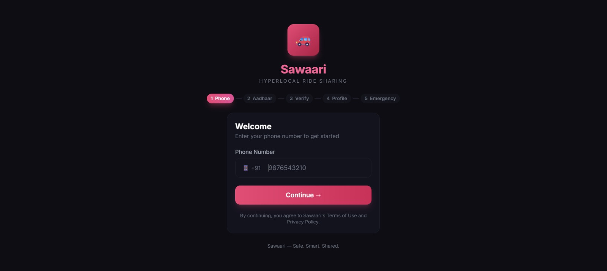
  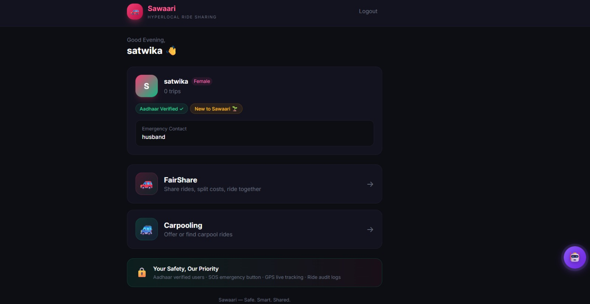
</p>

---

## 🌟 The Problem

Cab fares have skyrocketed. Splitting a ride is the obvious solution — but there's no reliable way to find someone heading the same direction, at the same time, from the same obscure starting point that isn't a railway station or bus stand.

So people either **overpay alone** or **don't travel at all.**

And every existing carpooling app assumes you're comfortable with forms, filters, dropdowns, and English. That eliminates most of India before they even open the app.

**Sawaari fixes all of that.**

---

## 🚀 Features

## 📱 Screenshots

### Onboarding & Signup
<p align="center">
  
  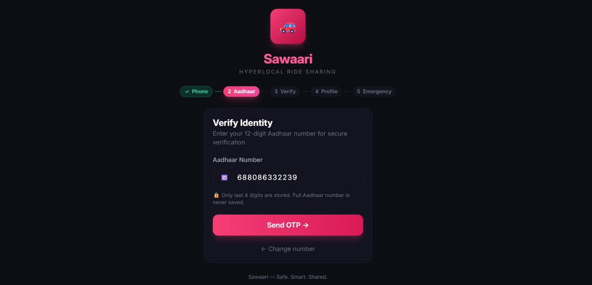
  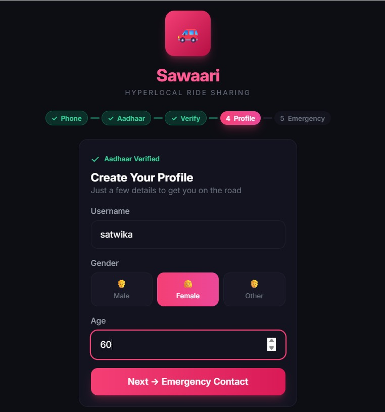
</p>

> *5-step verified onboarding — Phone → Aadhaar → OTP → Profile → Emergency Contact*

---

## 🚀 Features

### 🚕 FareShare — Public Transport Sharing
Connect with strangers heading the same way and split the cab fare. No vehicle ownership needed.

- Post a ride with source, destination, date, time and seat count
- Browse available rides with smart **route overlap matching** — a ride from City A → City D appears if you're going B → C along the same route
- **Autocomplete location search** powered by OpenStreetMap — type "Coimbatore railway" and get "Coimbatore Junction" just like Ola/Uber
- Coordinate-based proximity matching for accurate route overlap detection
- Rides auto-expire after scheduled time passes — no stale listings ever

<p align="center">
  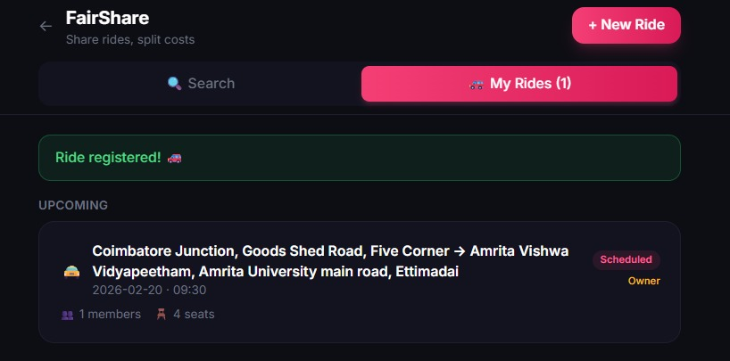
  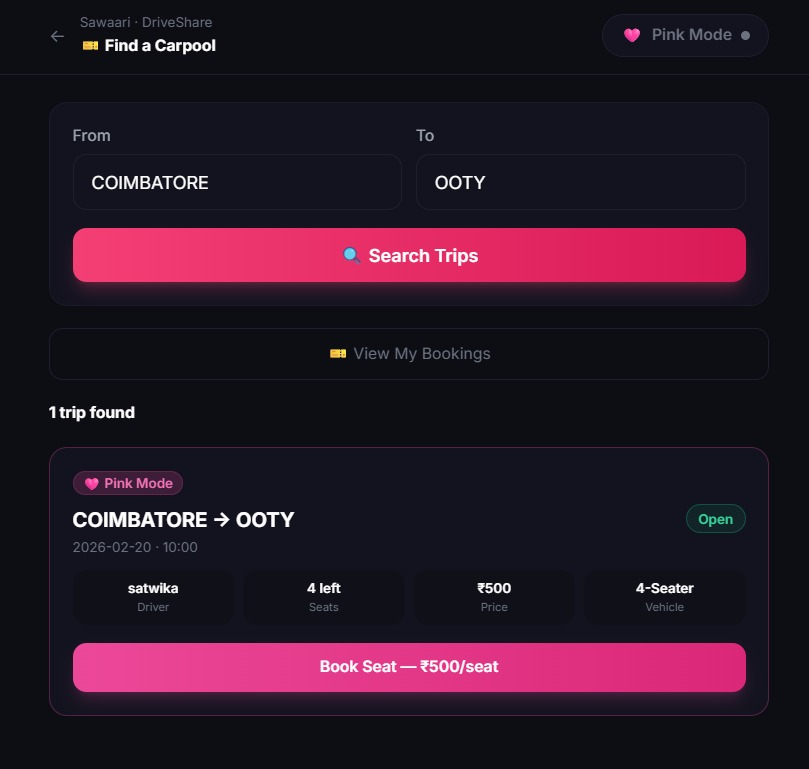
  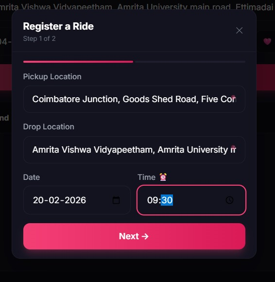
</p>

> *Smart location autocomplete · Ride cards with profile badges · Step-by-step ride registration*

<p align="center">
  
</p>

---

### 🚗 DriveShare — Carpooling
Own a vehicle? Offer seats on your daily route and earn while you commute.

- Register your vehicle with type, capacity and route details
- Accept or decline join requests — **you choose your co-passengers**
- Full driver profile visible to all potential passengers before they request
- Same smart route matching and location autocomplete as FareShare

<p align="center">
  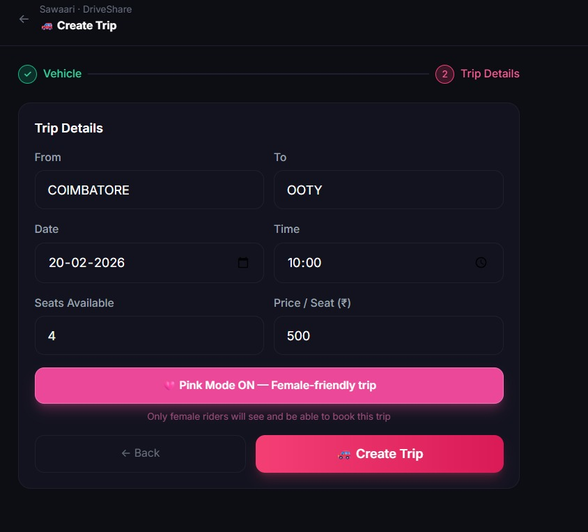
  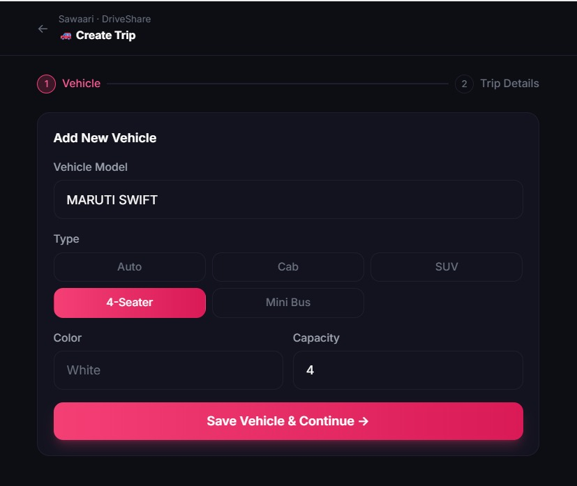
  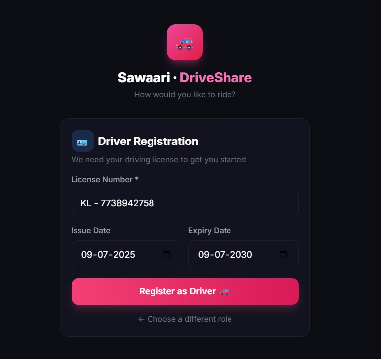
</p>

> *Choose your role · Register driving licence · Add vehicle details*

<p align="center">
  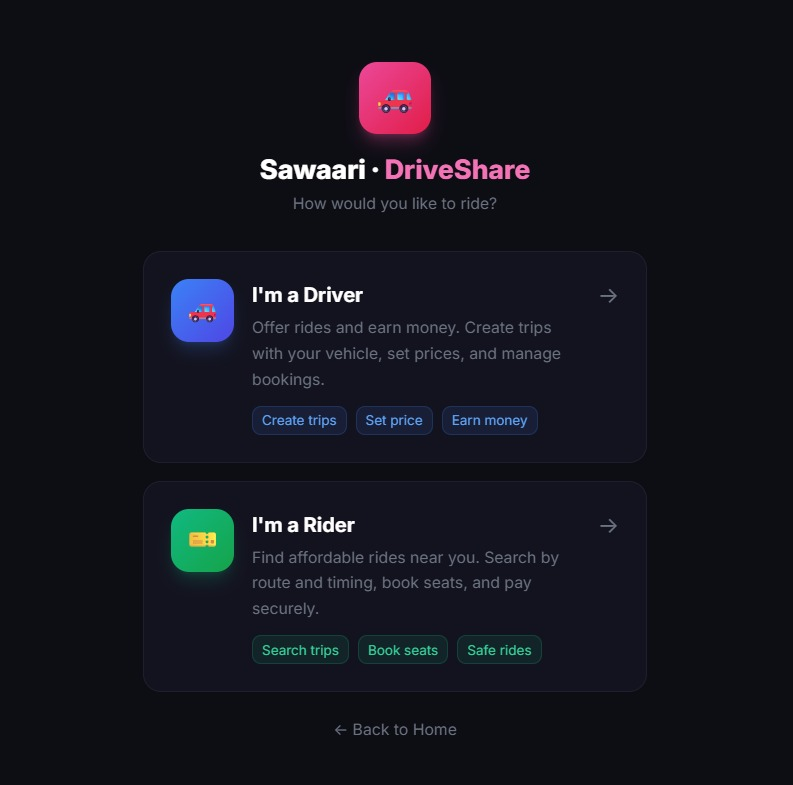
  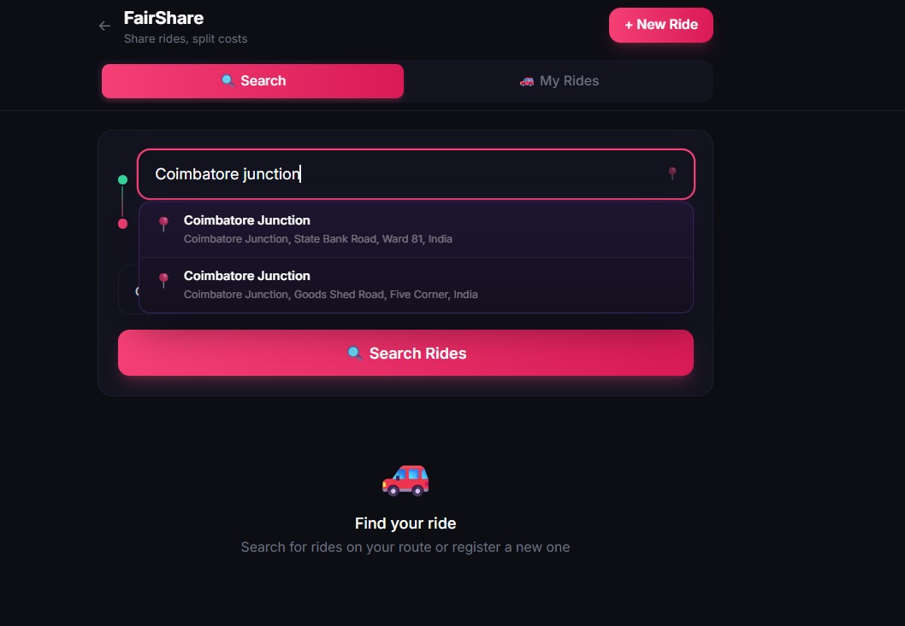
  
</p>

> *Create trip with Pink Mode toggle · Browse carpool rides · Manage your trips*

---

### 🩷 Pink Mode
One tap. Women only.

- Filter both FareShare and DriveShare to show only **female co-passengers and female drivers**
- Based on gender collected at signup — no manual tagging
- Available independently in both features
- Because safety isn't optional. It's a feature.

---

### 🤖 Sawaari AI — The Agentic Chatbot
The crown jewel. **Just talk to Sawaari.**

No forms. No dropdowns. No English required.

A floating AI assistant lives on every page. Tap it and just speak — in Tamil, Telugu, Malayalam, Hindi, or English. Sawaari AI understands your intent and does everything for you.

```
"நாளைக்கு காலையில் உக்கடம்லருந்து கோயம்புத்தூர் ஜங்ஷன் போக யாராவது இருக்காங்களா?"
"రేపు పొద్దున్నే హైదరాబాద్ నుండి సికింద్రాబాద్ వెళ్ళే వాళ్ళు ఎవరైనా ఉన్నారా?"
```

Sawaari hears it. Understands it. Finds the ride. Done.

<p align="center">
  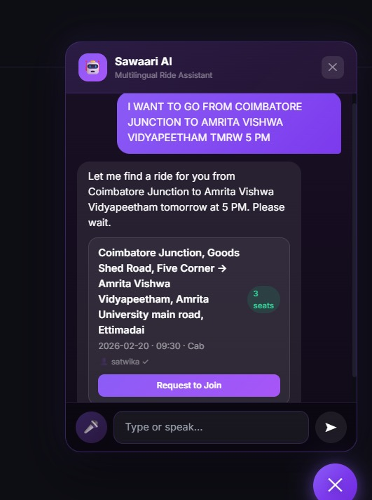
</p>

> *User typed "I WANT TO GO FROM COIMBATORE JUNCTION TO AMRITA VISHWA VIDYAPEETHAM TMRW 5 PM" — Sawaari AI understood the intent, searched the database, and returned a real ride card with a Request to Join button. No form. No filter. Just a sentence.*

**What Sawaari AI can do:**
- 🔍 Search rides by just describing where you want to go
- 📝 Register a ride conversationally — no form filling
- 🤝 Request to join a ride on your behalf
- ❓ Answer any question about how Sawaari works
- 🆘 **Trigger SOS instantly** if it detects distress in any language

---

### 🆘 SOS Emergency System
Your safety net during every ride.

- Red floating SOS button visible on every active ride page
- **5-second countdown** with cancel option to prevent accidents
- On trigger: captures live GPS coordinates and sends an alert with:
  - Your current location + Google Maps link
  - Vehicle registration number
  - All co-passenger names
  - Ride source and destination
- Alert goes to your **emergency contact** + nearest police station
- **Voice SOS** — if you say *உதவி / సహాయం / സഹായം / मदद / help* to Sawaari AI, SOS triggers **instantly with zero countdown**

---

### 🔐 Identity & Trust System

<p align="center">
  
</p>

> *Aadhaar Verified ✓ · New to Sawaari 🌱 · Emergency Contact · Trip count — all visible at a glance*

**Aadhaar Verification (Verhoeff Checksum)**
- Every user verifies their Aadhaar number at signup
- Uses UIDAI's official Verhoeff checksum algorithm to validate number authenticity
- Masked storage — only last 4 digits stored (XXXX-XXXX-4521)
- No one can join or create a ride without being Aadhaar verified

**Mutual Acceptance Model**
- Nobody auto-joins any ride
- Join requests show the requester's full profile to the ride owner
- Ride owner explicitly accepts or declines every request
- Passengers can view all existing members' profiles before requesting

**User Profiles & Reputation**
- ⭐ Star rating averaged across all completed rides
- Total trip count displayed on every profile
- 🌱 *New to Sawaari* badge for users with fewer than 3 trips
- ✓ *Verified Traveller* badge after 10+ trips
- *Aadhaar Verified* badge always shown

---

### 📍 Live GPS Tracking

- Ride owner confirms trip start at scheduled time
- Real-time GPS tracking begins via browser Geolocation API
- Live map powered by **Leaflet.js + OpenStreetMap** (no API key needed)
- All ride members see the live location on map
- **Shareable tracking link** — anyone with the link can view live location without an account (perfect for sharing with family)
- Tracking auto-stops after ride completion or 3 hours post-scheduled time

---

### 💬 Group Chat
When a ride has 2+ members a group chat automatically opens.

- Real-time messaging via **Socket.io**
- WhatsApp-style bubble UI
- Phone numbers **never shared** — all communication stays in-app
- Call button available — connects users without exposing numbers

---

### 🚘 Ride Audit Log
Every started ride creates a permanent tamper-proof record:

- All passenger Aadhaar numbers (masked)
- Vehicle registration number
- Timestamp, source, destination
- All member IDs

This log is **never deletable** — creating accountability for every journey.

---

## 🛠️ Tech Stack

| Layer | Technology |
|-------|-----------|
| Frontend | React + TailwindCSS |
| Backend | Node.js + Express |
| Database | SQLite |
| Real-time | Socket.io |
| Authentication | JWT + Aadhaar OTP (simulated) |
| Maps | Leaflet.js + OpenStreetMap |
| Location Search | Nominatim OpenStreetMap API |
| GPS Tracking | Browser Geolocation API |
| AI Brain | Groq API (llama-3.3-70b-versatile) |
| Voice Input | Azure AI Speech Service |
| Aadhaar Validation | Verhoeff Checksum Algorithm |

---

## 🗣️ Supported Languages

| Language | Voice Input | AI Reply |
|----------|------------|----------|
| English | ✅ | ✅ |
| தமிழ் (Tamil) | ✅ | ✅ |
| తెలుగు (Telugu) | ✅ | ✅ |
| മലയാളം (Malayalam) | ✅ | ✅ |
| हिन्दी (Hindi) | ✅ | ✅ |

---

## 👤 User Workflow

### New User Signup
```
Enter Phone Number
      ↓
Enter Aadhaar Number
      ↓
OTP Verification (Verhoeff validated)
      ↓
Enter Username + Gender + Age (15+ only)
      ↓
Set Emergency Contact (mandatory)
      ↓
Home → FareShare / DriveShare
```

<p align="center">
  
  
  
  
</p>

### Finding a Ride (App)
```
Open FareShare
      ↓
Type Source + Destination (autocomplete)
      ↓
Pick Date + Time
      ↓
Enter passenger count (male/female)
      ↓
Search → View overlapping rides
      ↓
View ride owner + member profiles
      ↓
Request to Join → Owner accepts/declines
      ↓
Group chat opens automatically
```

### Finding a Ride (Sawaari AI)
```
Tap floating AI button
      ↓
Speak in your language 🎙️
      ↓
Azure Speech transcribes → Groq understands
      ↓
Ride cards appear inside chat
      ↓
Tap "Request to Join" — done
```

### Starting a Ride
```
Scheduled time arrives → Popup appears
      ↓
"Has your trip started?" → Click Yes
      ↓
Enter vehicle registration number
      ↓
GPS tracking begins
      ↓
Share live tracking link with family
      ↓
Ride complete → Rate all co-passengers
```

---

## 🗃️ Database Schema

```
users
├── id, phone, username, gender, age
├── aadhaar_last4, aadhaar_verified
├── emergency_contact_name, emergency_contact_phone
└── trip_count, avg_rating

rides
├── id, user_id, source, destination
├── source_lat, source_lng
├── destination_lat, destination_lng
├── date, time, vehicle_type, seats_available
├── male_count, female_count
└── expires_at, vehicle_reg, status

ride_members
└── id, ride_id, user_id, joined_at

ride_requests
└── id, ride_id, requester_id, status, requested_at

ride_tracking
└── id, ride_id, lat, lng, timestamp

ride_audit_log
└── id, ride_id, started_at, source, destination,
    vehicle_reg, member_aadhaars (JSON), member_ids (JSON)

messages
└── id, ride_id, user_id, content, sent_at

ratings
└── id, ride_id, rated_by, rated_user, stars, created_at
```

---

## ⚙️ Environment Variables

```env
GROQ_API_KEY=gsk_...
AZURE_SPEECH_KEY=...
AZURE_SPEECH_REGION=centralindia
JWT_SECRET=<generate with: node -e "console.log(require('crypto').randomBytes(64).toString('hex'))">
```

---

## 🚦 Getting Started

```bash
# Clone the repository
git clone https://github.com/satwii/Shinchan-s-Sawaari.git
cd sawaari

# Install dependencies
npm install

# Set up environment variables
cp .env.example .env
# Fill in your API keys in .env

# Start the development server
npm run dev
```

---

## 🔒 Safety Philosophy

> Sawaari doesn't connect strangers. It connects **verified, rated, mutually consenting co-travellers** — with live tracking, instant SOS in five languages, and zero personal data exposure.

Every safety layer works together:
- **Before the ride** — Aadhaar verification + profile + ratings
- **Choosing co-passengers** — mutual acceptance, nobody forced
- **During the ride** — live GPS tracking + shareable link + SOS
- **After the ride** — audit log + mutual ratings

Safer than giving a lift to a random stranger on the road — because you know exactly who they are before you ever meet them.

---

## 👥 Team

Built with ❤️ for India 

---

*"The best ride isn't the cheapest one on the app. It's the one where you only pay for the seat you actually use — and you found it just by asking."*
